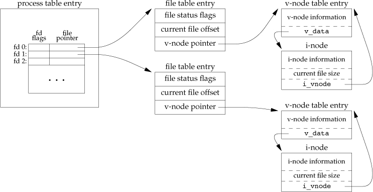
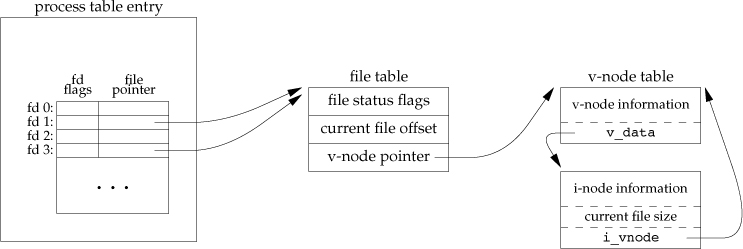
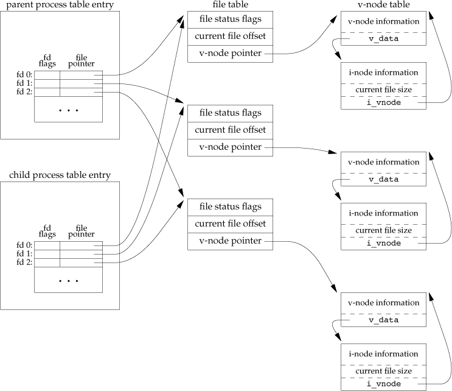

# signal

A signal is a notification to a process that an event has occurred. Signals are sometimes described as software interrupts, because in most cases, they interrupt the normal flow of execution of a program and their arrival is unpredictable.

A signal can be sent by Kernel or a Process.

A Kernel may send a signal to a process in the following scenarios:

1. When a hardware exception has occurred and that exception needs to be notified to the process. For eg. Attempting division by zero, or referencing the part of memory that is inaccessible.
2. Some software event occurred outside the process’s control but effects the process. For instance, input became available on a file descriptor, the terminal window got resized, process’s CPU time limit exceeded, etc.
3. User typed some terminal special characters like interrupt(Ctrl+C) or suspend character(Ctrl+Z).

## Pending Signals?

After a signal is generated due to some event, it does not directly get delivered to a process, and the signal remains in an intermediate state called to a pending state.

- Process is not scheduled to have CPU right now. In such a case, a pending signal is delivered as soon as the process is next scheduled to run.
-  to ensure that a signal does not arrive during execution of some critical section, a process can add signal to its process’s signal mask, which is a set of signals whose delivery is currently blocked. Process’s signal mask is a per process attribute. If a signal is generated when it is blocked, it remains in pending state until later it is unblocked. There are various system calls that allow a process to add and remove signals from its signal mask.

## What happens when a signal arrives?

When a signal is about to get delivered, one of the following *default* actions take place depending on the signal:

1. The signal is ignored, i.e., it is discarded by the kernel and has no effect on the process. (The process remains unaware that the event had even occurred.)
2. The process is terminated, a.k.a. abnormal process termination, as opposed to normal process termination that occurs when the program terminates using *exit().*
3. A core dump file is generated and the process is terminated.
4. The execution of the process is suspended or resumed.

Instead of accepting the default actions of a particular signal, a process can set the disposition of the signal by changing the action that occurs when the signal is delivered. 

*The signals SIGKILL and SIGSTOP cannot be caught, blocked or ignored.*

## How to send a signal?

A signal can be sent using either the kill system call, or the kill command, and specifying the desired pid of the process.

1. If pid > 0, then the signal is sent to a particular process with the specified pid.
2. If pid = 0, then the signal is sent to every process in the same process group.
3. If pid < -1, then the signal is sent to every process in the process group whose process group id is modulus of |pid| specified.
4. If pid = -1, then the signal is sent to all the processes for which the calling process has permission to send a signal, except *init* and the calling process itself. Signals sent in this fashion are called *Broadcast Signals*.

raise() sends a signal to the calling process itself.

One interesting use case of sending a signal is to check the existence of a process. If the *kill()* system call is called with signal argument as ‘0’, a.k.a. *null signal*, then no signal is sent, but it merely performs error checking to see if the process can be signaled.

# 2 From Boot To Panic

## Boot process

Under BIOS-based systems:

1. Power-on self-test (POST) and peripheral initializations
2. Jump to the boot code in the first 440 bytes of Master Boot Record (MBR)
3. MBR boot code locates and launches boot loader – ex) GRUB, Syslinux
4. Boot loader reads its configuration and possibly presents menu
5. Boot loader loads the kernel and launches it
6. Kernel unpacks the `initramfs` (initial RAM filesystem)
   - initial temporary root filesystem
   - contains device drivers needed to mount real root filesystem
7. Kernel switches to real root filesystem
8. Kernel launches the first user-level process `/sbin/init` (pid == 1)
   - `/sbin/init` is the mother of all processes
   - traditional SysV-style init reads `/etc/inittab`
   - in Arch, `/sbin/init` is a symlink to `systemd`

## User session

1. `init` calls `getty`
   - `getty` is called for each virtual terminal (normally 6 of them)
   - `getty` checks user name and password against `/etc/passwd`
2. `getty` calls `login`, which then runs the user’s shell – ex) `bash`
   - `login` sets the user’s environment variables
   - the user’s shell is specified in `/etc/passwd`

## Process control

### Displaying process hierarchy

```
ps axf     # display process tree

ps axfj    # with more info

ps axfjww  # even if lines wrap around terminal
```

### Creating processes

Simple shell program from APUE3, 1.6:

```
#include "apue.h"
#include <sys/wait.h>

int
main(void)
{
        char	buf[MAXLINE];	/* from apue.h */
        pid_t	pid;
        int		status;

        printf("%% ");	/* print prompt (printf requires %% to print %) */
        while (fgets(buf, MAXLINE, stdin) != NULL) {
                if (buf[strlen(buf) - 1] == '\n')
                        buf[strlen(buf) - 1] = 0; /* replace newline with null */

                if ((pid = fork()) < 0) {
                        err_sys("fork error");
                } else if (pid == 0) {		/* child */
                        execlp(buf, buf, (char *)0);
                        err_ret("couldn't execute: %s", buf);
                        exit(127);
                }

                /* parent */
                if ((pid = waitpid(pid, &status, 0)) < 0)
                        err_sys("waitpid error");
                printf("%% ");
        }
        exit(0);
}
```

Questions:

- What happens if the parent process terminates before its children?

  the child process will be a child process of init process

- What happens if a child process has terminated, but the parent never calls `waitpid()`?

  

  os Wait to clean the process until the parent calls the `waitpid`,

  it become a zombie process 

## Signals

How do you terminate the following program?

```
#include <stdio.h>
#include <stdlib.h>
#include <signal.h>
#include <unistd.h>

static void sig_int(int signo)
{
    printf("stop pressing ctrl-c!\n");
}

int main()
{
    if (signal(SIGINT, &sig_int) == SIG_ERR) {
        perror("signal() failed");
        exit(1);
    }

    int i = 0;
    for (;;) {
        printf("%d\n", i++);
        sleep(1);
    }
}
```

How about this one?

```
#include <stdio.h>
#include <stdlib.h>
#include <signal.h>
#include <unistd.h>

static void sig_int(int signo)
{
    printf("stop pressing ctrl-c!\n");
}

static void sig_term(int signo)
{
    printf("stop trying to kill me!\n");
}

int main()
{
    if (signal(SIGINT, &sig_int) == SIG_ERR) {
        perror("signal() failed");
        exit(1);
    }

    if (signal(SIGTERM, &sig_term) == SIG_ERR) {
        perror("signal() failed");
        exit(1);
    }

    int i = 0;
    for (;;) {
        printf("%d\n", i++);
        sleep(1);
    }
}
```

## X session

Let’s take a look at the processes in your X session:

```
 145 ?        Ss     0:00 login -- jae     
 406 tty1     Ss     0:00  \_ -bash
 421 tty1     S+     0:00      \_ xinit /etc/xdg/xfce4/xinitrc -- /etc/X11/xinit/xserverrc
 422 ?        Ss     0:03          \_ /usr/bin/X -nolisten tcp :0 vt1
 425 tty1     S      0:00          \_ sh /etc/xdg/xfce4/xinitrc
 430 tty1     Sl     0:00              \_ xfce4-session
 448 tty1     S      0:00                  \_ xfwm4 --display :0.0 --sm-client-id 27c950fe4-6
 450 tty1     Sl     0:00                  \_ Thunar --sm-client-id 2ed5a75a5-2f67-42c8-9765-
 452 tty1     Sl     0:01                  \_ xfce4-panel --display :0.0 --sm-client-id 24a77
 494 tty1     S      0:00                  |   \_ /usr/lib/xfce4/panel/wrapper /usr/lib/xfce4
 498 tty1     S      0:00                  |   \_ /usr/lib/xfce4/panel/wrapper /usr/lib/xfce4
 454 tty1     Sl     0:00                  \_ xfdesktop --display :0.0 --sm-client-id 29a760d
 456 tty1     Sl     0:01                  \_ xfce4-terminal --geometry=100x36 --display :0.0
 505 tty1     S      0:00                      \_ gnome-pty-helper
 507 pts/0    Ss+    0:00                      \_ bash
 518 pts/1    Ss     0:00                      \_ bash
2330 pts/1    R+     0:00                      |   \_ ps afx
1218 pts/2    Ss+    0:00                      \_ bash
```

Explorations:

- Identify the function of each process
- Understand the network client-server architecture of X window system
- Try running a simpler X session – `twm` or even just `xterm`

## Kernel module

Here is a simple kernel module:

```
#include <linux/init.h>
#include <linux/module.h>
#include <linux/kernel.h>

/* This function is called when the module is loaded. */
int simple_init(void)
{
       printk(KERN_INFO "Loading Module\n");

       return 0;
}

/* This function is called when the module is removed. */
void simple_exit(void) {
        printk(KERN_INFO "Removing Module\n");
}

/* Macros for registering module entry and exit points. */
module_init( simple_init );
module_exit( simple_exit );

MODULE_LICENSE("GPL");
MODULE_DESCRIPTION("Simple Module");
MODULE_AUTHOR("SGG");
```

Here is the Makefile:

```
obj-m += simple.o
all:
        make -C /lib/modules/$(shell uname -r)/build M=$(PWD) modules
clean:
        make -C /lib/modules/$(shell uname -r)/build M=$(PWD) clean
```

Can you modify the code to cause the kernel panic?

## References

- [Source code for this lecture](http://www.cs.columbia.edu/~jae/4118/L02/)

------

*Last updated: 2019–01–24*

# 3 UNIX File I/O

## File I/O system calls

### open

Example (taken from `man open` in Linux):

```
#include <fcntl.h>
...
int fd;
mode_t mode = S_IRUSR | S_IWUSR | S_IRGRP | S_IROTH;
char *pathname = "/tmp/file";
...
fd = open(pathname, O_WRONLY | O_CREAT | O_TRUNC, mode);
...
```

Another example – creating a lock file:

```
fd = open("/var/run/myprog.pid", O_WRONLY | O_CREAT | O_EXCL, 0644);
```

### creat

Redundant: `creat(path, mode)` is equivalent to `open(path, O_WRONLY|O_CREAT|O_TRUNC, mode)`

And it should have been called `create`, says Ken Thompson

### close

```
int close(int fildes);
```

### lseek

```
off_t lseek(int fildes, off_t offset, int whence);
```

- If whence is SEEK_SET, the file offset shall be set to offset bytes.
- If whence is SEEK_CUR, the file offset shall be set to its current location plus offset.
- If whence is SEEK_END, the file offset shall be set to the size of the file plus offset.

### read

```
ssize_t read(int fildes, void *buf, size_t nbyte);
```

- returns number of bytes read, 0 if end of file, -1 on error

Note:

- Number of bytes read may be less than the requested nbyte

- `read()` may block forever on a “slow” read from pipes, FIFOs (aka named pipes), sockets, or keyboard

- For sockets, `read(socket, buf, nbyte)` is equivalent to `recv(socket, buf, nbyte, 0)` 0 means normal behavior

  ```
  recv(int socket, void *buffer, size_t length, int flags)
  ```

  - normally, recv() blocks until it has received at least 1 byte
  - returns num bytes received, 0 if connection closed, -1 if error

### write

```
ssize_t write(int fildes, const void *buf, size_t nbyte);
```

- returns number of bytes written, -1 on error

Note:

- Number of bytes written may be less than the requested nbyte – ex) filling up a disk

- `write()` may block forever on a “slow” write into pipes, FIFOs, or sockets

  two process, one write into pipe, two read from pipe, if two sleep and dont read, the buffer in pipe is filled, the one can not write anymore

- For sockets, `write(socket, buf, nbyte)` is equivalent to `send(socket, buf, nbyte, 0)`

  ```
  send(int socket, const void *buffer, size_t length, int flags)
  ```

  - normally, send() blocks until it sends all bytes requested
  - returns num bytes sent or -1 for error

- If the file was opened with `O_APPEND` flag, the file offset gets set to the end of the file prior to each write

  - setting of the offset and writing happen in an atomic operation **prevent two process write the same file and overwrite each other** 

    

# 7存储空间布局


* 正文段：由CPU执行的机器指令部分
* 初始化数据段：包含了程序中需明确地赋值的变量 eg: int maxcount=90;
* 未初始化的数据： eg: long sum[1000];
* 栈：自动变量以及每次函数调用时所需保存的信息
* 堆：在堆中进行动态存储分配

# 8 Process Control

Every process has a unique process ID, a non-negative integer

Process ID 0 is usually the scheduler process and is often known as the swapper. No program on disk corresponds to this process, which is part of the kernel and is known as a system process. Process ID 1 is usually the init process and is invoked by the kernel at the end of the bootstrap procedure, The program file for this process was /etc/init in older versions of the UNIX System and is /sbin/init in newer versions.

The init process never dies. It is a normal user process, not a system process within the kernel,


## fork

```
#include <unistd.h> 
pid_t fork(void);
Returns: 0 in child, process ID of child in parent, −1 on error
```

The child is a copy of the parent. For example, the child gets a copy of the parent’s data space, heap, and stack. **this is copy, not share**.The parent and the child do share the text segment,

## file sharing

1. Kernel data structures for open files

   Figure 3.7, APUE

2. Two independent processes with the same file open

   Figure 3.8, APUE

3. Kernel data structures after `dup(1)`

   Figure 3.9, APUE

4. Sharing of open files between parent and child after `fork`

   Figure 8.2, APUE

open and fork: AABBCCDD

fork and open:ABCD


## vfork

The vfork function creates the new process, just like fork, without copying the address space of the parent into the child, as the child won’t reference that address space; the child simply calls exec (or exit) right after the vfork. Instead, the child runs in the address space of the parent until it calls either exec or exit.


## exit

Five normal ways to terminate a process

1. return from the main function
2. Calling the exit function
3. Calling the _exit or _Exit function.
4. Executing a return from the start routine of the last thread in the process.
5. Calling the pthread_exit function from the last thread in the process.

three abnormal way:

1. Calling abort. This is a special case of the next item, as it generates the SIGABRT signal.
2. When the process receives certain signals.
3. The last thread responds to a cancellation request.


**Regardless of how a process terminates, the same code in the kernel is eventually executed. This kernel code closes all the open descriptors for the process, releases the memory that it was using, and so on.**

**the parent of the process can obtain the termination status from either the wait or the waitpid function**

Now we’re talking about returning a termination status to the parent. But what happens if the parent terminates before the child? The answer is that the **init process becomes the parent process of any process whose parent terminates.**This way, we’re guaranteed that every process has a parent.

For any of the preceding cases, we want the terminating process to be able to notify its parent how it terminated.

In any case, the parent of the process can obtain the termination status from either the **wait or the waitpid function**.

a process that has terminated, but whose parent has not yet waited for it, is called a zombie.

## wait and waitpid

When a process terminates, either normally or abnormally, the kernel notifies the parent by sending the SIGCHLD signal to the parent.

a process that calls wait or waitpid can

• Block, if all of its children are still running

• Return immediately with the termination status of a child, if a child has terminated and is waiting for its termination status to be fetched

• Return immediately with an error, if it doesn’t have any child processes

```
#include <sys/wait.h> 
pid_t wait(int *statloc); 
pid_t waitpid(pid_t pid, int *statloc, int options); 
       Both return: process ID if OK, 0 (see later), or −1 on error
```

  wait()函数用于使父进程（也就是调用wait()的进程）**阻塞**，直到一个子进程结束或者该进程接收到了一个指定的信号为止。如果该父进程没有子进程或者它的子进程已经结束，则wait()函数就会立即返回。

  waitpid()的作用和wait()一样，但它并不一定要等待第一个终止的子进程（它可以指定需要等待终止的子进程），它还有若干选项，如可提供一个**非阻塞**版本的 wait()功能，也能支持作业控制。实际上，wait()函数只是 waitpid()函数的一个特例，在Linux 内部实现 wait()函数时直接调用的就是waitpid()函数。

the argument statloc is a pointer to an integer.If this argument is not a null pointer, the **termination status of the terminated process is stored in the location pointed to by the argument**. If we don’t care about the termination status, we simply pass a null pointer as this argument.


The interpretation of the pid argument for waitpid depends on its value:

pid == −1 pid > 0 pid == 0 pid < −1

Waits for any child process. In this respect, waitpid is equivalent to wait.

Waits for the child whose process ID equals pid.

Waits for any child whose process group ID equals that of the calling process. (We discuss process groups in Section 9.4.)

Waits for any child whose process group ID equals the absolute value of pid.


The waitpid function provides three features that aren’t provided by the wait function.

1. The waitpid function lets us wait for one particular process, whereas the wait function returns the status of any terminated child. We’ll return to this feature when we discuss the popen function.

2. The waitpid function provides a nonblocking version of wait. There are times when we want to fetch a child’s status, but we don’t want to block.

3. The waitpid function provides support for job control with the WUNTRACED and WCONTINUED options.

## waitid

```
#include <sys/wait.h> 
int waitid(idtype_t idtype, id_t id, siginfo_t *infop, int options); 
                                    Returns: 0 if OK, −1 on error
```


The infop argument is a pointer to a siginfo structure. This structure contains detailed information about the signal generated that caused the state change in the child process.


## race conditions

a race condition occurs when multiple processes are trying to do something with shared data and the final outcome depends on the order in which the processes run.

fork may cause race conditions.

use

```
TELL_WAIT()
WAIT_PARENT()
TELL_CHILD(pid)
```

to avoid race 

## exec

one use of the **fork** function is to create a new process (the child) that then causes another program to be executed by calling one of the **exec** functions.

When a process calls one of the exec functions, that process is completely replaced by the new program, and the new program starts executing at its main function.**pid** remain the same

**With fork, we can create new processes; and with the exec functions, we can initiate new programs.**

There are seven exec functions


fork函数是用于创建一个子进程，该子进程几乎是父进程的副本，而有时我们希望子进程去执行另外的程序，exec函数族就提供了一个在进程中启动另一个程序执行的方法。它可以根据指定的文件名或目录名找到可执行文件，并用它来取代原调用进程的数据段、代码段和堆栈段，在执行完之后，原调用进程的内容除了进程号外，其他全部被新程序的内容替换了。另外，这里的可执行文件既可以是二进制文件，也可以是Linux下任何可执行脚本文件。


# 9 进程关系

## 9.4 进程组

每个进程除了有一个进程ID之外，还属于一个进程组。

进程组是一个或多个进程的集合，同一进程组中的各进程接收来自同一终端的各种信号，

```
#include <unistd.h>
pid_t getpgrp(void);
```

每个进程组有一个组长进程，组长进程的进程组ID等于其进程ID

加入一个现有的进程组

```
#include <unistd.h>
int setpgid(pid_t pid, pid_t pgid);
```

setpgid将pid进程的进程组ID设置为pgid，

## 9.5 会话

会话（session)是一个或多个进程组的集合。

进程调用setsid函数建立一个新会话

```
#include <unistd.h>

pid_t setsid(void)
       成功返回进程组id，error->-1
```


# 10 信号

## 10.8 可靠信号术语

造成信号的事件发生时，进程**产生**一个信号。

当对信号采取了动作时，向进程**递送**了一个信号。

在信号产生和递送之间的时间间隔内，信号是未决的(pending)。

每个进程都有一个信号屏蔽字（signal mask），它规定了当前要阻塞递送到该进程的信号集。

## 10.9 kill and raise

kill函数将信号发送给进程或进程组，raise函数则允许进程向自身发送信号。

```
#include <signal.h>

int kill (pid_t pid, int signo);

int raise(int signo);
                        成功返回0，失败返回-1
```

Raise(signo)=kill(getpid(),signo)

Kill(pid_t pid, int signo)

* pid>0: 发送个pid这个进程

* pid=0: 发送给与发送进程属于同一进程组的所有进程

* pid<0: 发送给|pid|这个进程组的进程

* pid=-1: 发送给有权限的所有进程

## 10.10 alarm和pause

alarm函数可以设置一个定时器，定时器超时时，产生SIGALRM信号，如果忽略或不捕捉此信号，将终止该进程

```
# include <unistd.h>
unsigned int alarm(unsigned int seconds)
               返回值：0或以前设置的闹钟时间的余留秒数
```

pause函数使调用进程挂起直至捕捉到一个信号

```
# include<unistd.h>
int pause(void);
```

只有执行了一个信号处理程序并从其返回时，pause才返回，这种情况下，pause返回-1，errno设置为EINTR

## 10.12 sigprocmask

sigprocmask可以检测或更改信号屏蔽字

```
# include <signal.h>
int sigprocmask(int how, const sigset_t *restrict set,sigset_t *restrict oset);
成功返回0 出错-1
```

how:

* SIG_BLOCK:  set包含了希望阻塞的附加信号
* SIG_UNBLOCK: set包含了希望解除阻塞的信号
* SIG_SETMASK: 该进程新的信号屏蔽是set指向的值

## 10.13 sigpending

```
#include<signal.h>
int sigpending(sigset_T *set);

```

返回阻塞的信号集，通过set返回

## 10.14 sigaction

sigaction的功能是检查或修改与指定信号相关联的处理动作。

```
#include<signal.h>
int sigaction(int signo, const struct sigaction *restrict act, struct sigaction *restrict oact);
```


# 11 线程

线程标识：pthread_t

Pthread_t pthread_self(void)


如果进程中的任意线程调用了exit,_____exit，或者_Exit,整个进程就会终止

单个线程退出

1. 从启动例程返回，返回值是线程的退出码

2. 线程可以被同一进程中的其他线程取消

3. 线程调用pthread_exit

   

## 线程同步


## 互斥量

互斥量（mutex)从本质上说是一把锁，在访问共享资源前对互斥量进行加锁，在访问后释放互斥量。对互斥量加锁后，其他试图加锁的线程都会被阻塞直到当前线程释放。

互斥变量：pthread_mutex_t


可以使用pthread_mutex_trylock尝试对互斥量进行加锁，如果调用pthread_mutex_trylock时互斥量处于未锁住状态，那么pthread_mutex_trylock将锁住互斥量，失败则返回EBUSY，不会出现阻塞。

## 避免产生死锁

线程1占有互斥量1，想锁互斥量2，线程2占有互斥量2，想锁1.

1. 可以通过仔细控制互斥量加锁的顺序来避免死锁的发生。
2. 可以使用pthread_mutex_trylock避免死锁，如果返回成功，则继续前进，若失败，则可以释放已经占有的锁。


Pthread_mutex_timedlock

允许绑定线程阻塞时间，达到超过时间，返回错误码ETIMEDOUT


## 读写锁

读写锁与互斥量相似，但是允许更高的并行性。

* 互斥量：要么是锁住状态，要么是不加锁状态，且一次只有一个线程可以对其加锁。
* 读写锁：三种状态： 读模式加锁，写模式加锁，不加锁。一次只有一个线程可以占有写模式的读写锁，但是多个线程可以同时占有读模式的读写锁
  * 写加锁状态时，所有线程都无法对其加锁
  * 读加锁状态时，所有线程以读可加锁，以写不可加锁
  * 读加锁状态时，一个线程试图写锁，此后阻塞读锁请求，避免读模式锁长期占有

读写锁适合读>>写的情况，也称共享互斥锁。

带有超时的读写锁：

Pthread_rwlock_timedrdlock 和 pthread_rwlock_timedwrlock

## 条件变量

条件变量给多个线程提供了一个回合的场所。条件变量与互斥量一起使用时，允许线程以无竞争的方式等待特定的条件发生。

线程在改变条件状态之前必须首先锁住互斥量。

初始化和反初始化


## 自旋锁

自旋锁与互斥量类似，他不通过休眠使进程阻塞，而是在获取锁之前一直处于忙等阻塞状态。

一种是没有获取到锁的线程就一直循环等待判断该资源是否已经释放锁，这种锁叫做`自旋锁`，它不用将线程阻塞起来(NON-BLOCKING)；还有一种处理方式就是把自己阻塞起来，等待重新调度请求，这种叫做`互斥锁`。

适用于：锁被持有的时间短，并且线程并不希望在重新调度上花费太多的成本。

## 屏障

屏障是用户协调多个线程并行工作的同步机制。屏障允许每个线程等待，直到所有的合作线程都到达某一点，然后从该点继续执行。

它允许任意数量的线程等待。


# 14 高级IO

## 14.2非阻塞I/O

非阻塞I/O使我们可以发出open，read，和write这样的I/O操作，并使这些操作不会永远阻塞。如果这种操作不能完成，则调用立即出错返回。

两种指定非阻塞I/O方法

1. 若调用open获得描述符，则可指定O_NONBLOCK标志
2. 对于一个已经打开的描述符，则可调用fcnt1，由该函数打开O_NONBLOCK标志。


## 14.4 I/O多路转接


另一种方法：使用一个进程执行，但使用非阻塞I/O读取数据。这种方法是浪费CPU时间，大多数时间实际上是无数据可读的，因此执行read系统调用浪费了时间。

还有一种方法为异步I/O：当描述符准备好可以进行I/O时，用一个信号通知它，但这种信号对每个进程只有一个（SIGPOLL或SIGIO)，如果该信号对两个描述符都起作用，则无法判断哪个描述符准备好了。

比较好的技术是I/O多路转接。构造一张我们感兴趣的描述符的列表，然后调用一个函数，直到这些描述符中的一个已准备好进行I/O时，该函数才返回。

### select和pselect

select可实现I/O多路转接，

传入：描述符，每个描述符我们所关心的条件，愿意等待的时间

返回：已准备好的描述符的总数量，对于读、写、异常这三个条件中的每一个，哪些描述符已准备好

Tvptr==NULL 永远等待

Tvptr ->tr_sec==0 &&Tvptr ->tr_usec==0 不等待

Tvptr ->tr_sec！=0 &&Tvptr ->tr_usec！=0 等待指定的秒数 

## 14.8 存储映射I/O

Memory-mapped I/O将一个磁盘文件映射到存储空间中的一个缓冲区上，于是，从缓冲区中取数据时，就相当于读文件中的相应字节。

首先，告诉内核将一个给定的文件映射到一个存储区域中。


addr:映射存储区的起始地址

fd:被映射文件的描述符

prot:映射存储区的保护要求


flag参数：

MAP_FIXED: 返回值等于addr

MAP_SHARED:指定存储操作修改映射文件，存储操作相当于对文件的write

MPA_PRIVATE:表示对映射区的存储操作导致创建该映射文件的一个私有副本。


off和addr通常被要求是系统虚拟存储页长度的倍数


与映射区相关的信号有 SIGSEGV 和 SIGBUS

SIGSEGV: 用于指示进程试图访问对它不可用的存储区

SIGBUS：映射区的某个部分在访问时已不存在。


子进程能通过fork继承存储映射区，新程序不能通过exec继承存储映射区

# 15 interprocess communication

## pipes

limitation

1. Historically, they have been half duplex (i.e., data flows in only one direction). Some systems now provide full-duplex pipes, but for maximum portability, we should never assume that this is the case.
2. Pipes can be used only between processes that have a common ancestor. Normally, a pipe is created by a process, that process calls fork, and the pipe is used between the parent and the child.

A pipe is created by calling the pipe function.

```
#include <unistd.h> 

int pipe(int fd[2]);

																	Returns: 0 if OK, −1 on error
```

Two file descriptors are returned through the fd argument: fd[0] is open for reading, and fd[1] is open for writing.

Two ways to picture a half-duplex pipe are shown in Figure 15.2. The left half of the figure shows the two ends of the pipe connected in a single process. The right half of the figure emphasizes that the data in the pipe flows through the kernel.

single process


after fork()


then what happens depends on which direction of data flow we want


1. If we read from a pipe whose write end has been closed, read returns 0 to indicate an end of file after all the data has been read.
2. If we write to a pipe whose read end has been closed, the signal SIGPIPE is generated. If we either ignore the signal or catch it and return from the signal handler, write returns −1 with errno set to EPIPE.


## 15.10 POSIX信号量

## 总结

## Summary of UNIX IPC so far

- Shared memory
  - Anonymous mmap between related process (i.e., parent and child)
  - File-backed mmap or XSI shared memory between unrelated processes
- Synchronization
  1. Multiple threads in a single process
     - pthread mutex, rw lock, condition variable
  2. Multiple threads & processes sharing a memory region
     - Unnamed POSIX semaphore
     - pthread mutex, rw lock, condition variable with PTHREAD_PROCESS_SHARED attribute
  3. Multiple processes with no shared memory
     - Named POSIX semaphore
- Pipe
  - only between related processes
  - half duplex (i.e., one way communication)
- FIFO (aka named pipe)
  - represented as a file, thus can be used between unrelated processes
  - still half duplex
- TCP socket
  - connects any two processes including remote processes
  - full duplex
  - high protocol overhead
  - reliable stream socket – reliable byte stream, but message boundaries are not preserved
- UDP sockets
  - lower protocol overhead than TCP
  - unreliable datagram socket – message boundaries are preserved, but deliveries are unreliable

POSIX信号量机制是3种IPC机制之一（消息队列，信号量，共享存储）

信号量有两种形式：命名的和未命名的


# 16 Network IPC: Sockets

## socket descriptors

A socket is an abstraction of a communication endpoint. Just as they would use file descriptors to access files, applications use socket descriptors to access sockets.

```
#include <sys/socket.h> 
int socket(int domain, int type, int protocol); 
                Returns: file (socket) descriptor if OK, −1 on error
```


The default protocol for a **SOCK_STREAM** socket in the AF_INET communication domain is **TCP** (Transmission Control Protocol). The default protocol for a **SOCK_DGRAM** socket in the AF_INET communication domain is **UDP** (User Datagram Protocol).

With a datagram (SOCK_DGRAM) interface, no logical connection needs to exist between peers for them to communicate.

A byte stream (SOCK_STREAM), in contrast, requires that, before you can exchange data, you set up a logical connection

A **SOCK_STREAM** socket provides a byte-stream service; applications are unaware of message boundaries.


Communication on a socket is bidirectional. We can disable I/O on a socket with the shutdown function.

```
#include <sys/socket.h> 
int shutdown(int sockfd, int how);
											Returns: 0 if OK, −1 on error
```

how is SHUT_RD, then reading from the socket is disabled.

how is SHUT_WR, then we can’t use the socket for transmitting data

SHUT_RDWR to disable both data transmission and reception.

